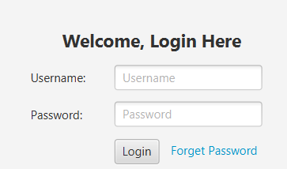
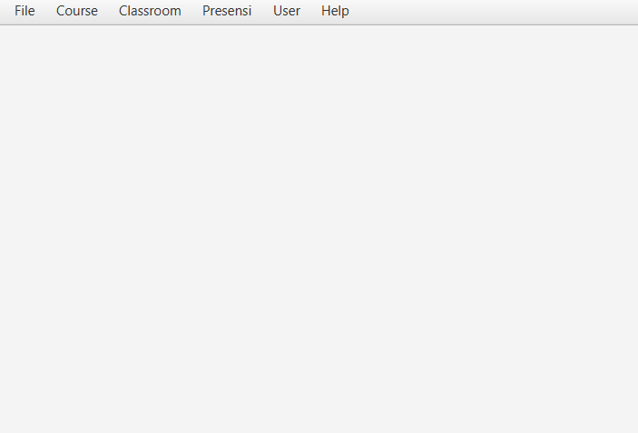
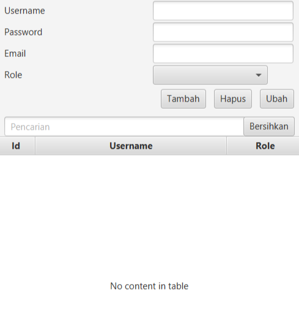
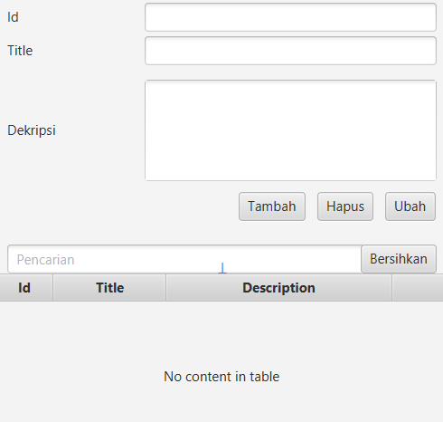
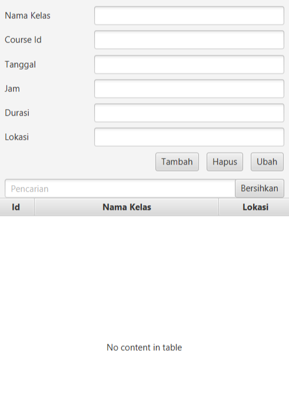
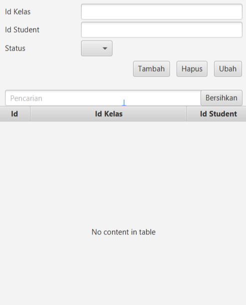

# Sistem Manajemen Kehadiran Siswa berbasis GUI
Sistem Manajemen Kehadiran Siswa adalah sistem untuk membantu sekolah mengelola catatan kehadiran mereka secara efisien.
Sistem ini menyediakan antarmuka berbasis GUI sederhana dengan menggunakan JavaFX untuk navigasi menu dan interaksi.
Sistem ini menggunakan SQLite atau MariaDb sebagai database  untuk menyimpan kehadiran dengan aman.
Sistem ini menekankan prinsip-prinsip Pemrograman Berorientasi Objek (OOP) untuk memastikan modularitas kode, reuseability,
dan pemeliharaan.

## Kebutuhan sistem
Pengerjaan terbagi menjadi 2 tahap.
### Tahap 1 adalah sebagai berikut :
1. Otentikasi Pengguna: Pengguna dapat masuk ke sistem menggunakan kredensial mereka (username dan password). Menerapkan mekanisme otentikasi dan otorisasi dasar.  
       
2. Menu Utama: Menu utama adalah tampilan awal aplikasi sistem kehadiran siswa. User akan otomatis masuk pada menu ini jika berhasil melakukan login.      
   
3. Manajemen Pengguna: Admin dapat menambah, mengedit, dan menghapus akun pengguna. Pengguna dapat memperbarui informasi profil mereka (misalnya nama, email).    
   
4. Manajemen Course: Admin dapat membuat, mengedit, dan menghapus Course. Setiap Course harus memiliki pengidentifikasi, judul, dan deskripsi unik.    
   
5. Manajemen Kelas: Admin dapat menjadwalkan kelas untuk setiap Course. Setiap kelas harus memiliki detail seperti tanggal, waktu, durasi, dan lokasi.    
   
7. Pencatatan Kehadiran: Pengguna dapat menandai kehadiran siswa di setiap kelas. Kehadiran dapat ditandai sebagai hadir, tidak hadir, atau terlambat.  
   

### Tahap 2 adalah sebagai berikut :
1. Laporan Kehadiran: 
   - Menghasilkan laporan kehadiran untuk masing-masing siswa pada setiap kelas. 
   - Laporan harus mencakup persentase kehadiran, jumlah kelas yang dihadiri, dan 
   - Laporan jumlah kelas yang diselenggarakan.
   - Ketiga laporan, ditampilkan dengan ringkas menggunakan chart yang pilihannya ada pada MainMenu.
2. Menerapkan Session untuk sistem login.
3. Menerapkan Pola desain singleton untuk koneksi basis datanya.  
4. Menerapkan prinsip Inversion of Control dengan pola desain Dependency Injection dan service locator untuk mempermudah penggantian database engine (SqlLite atau MariaDb)
5. Menerapkan pola desain Data Access Object pada mekanisme akses basis datanya 
6. Menerapkan Arsitektur Model View Presenter sebagai arsitektur aplikasinya
6. Dokumentasi: Menyediakan dokumentasi komprehensif termasuk ikhtisar proyek, arsitektur sistem, panduan pengguna, dan dokumentasi pengembang. Sertakan petunjuk pengaturan, pedoman penggunaan, dan tip pemecahan masalah.
